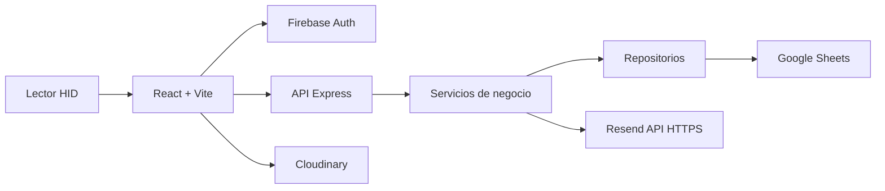
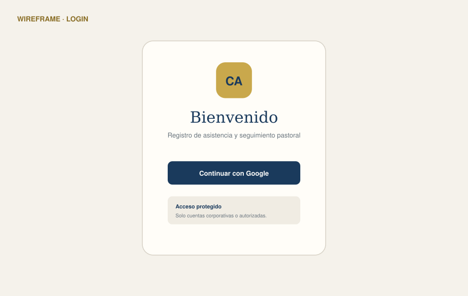

# Registro de Asistencia Iglesia

Aplicación web para registrar asistencia mediante un lector Newland configurado como teclado HID, administrar miembros y líderes, consultar métricas y preparar reportes de seguimiento pastoral.

## Estado del entregable

El repositorio incluye un **MVP funcional** con modo de demostración y una integración preparada para Google Sheets, Firebase Auth, Cloudinary y Resend. La infraestructura recomendada es Cloudflare Workers Static Assets para el frontend y Render para la API. Antes de usar datos reales deben configurarse las credenciales, reglas de acceso, consentimiento de tratamiento de datos, copias de seguridad y una prueba piloto controlada.

> Google Sheets es adecuado para un piloto de volumen moderado. No ofrece transacciones ni restricciones únicas como una base relacional. Para varias sedes, múltiples servidores o alta concurrencia, migra a MySQL/PostgreSQL siguiendo `docs/MIGRACION_MYSQL.md`.

## Arquitectura



- `frontend/`: React, Vite, Material UI, Firebase Auth, carga firmada a Cloudinary y diseño responsive.
- `backend/`: Express 5, validación, roles, servicios, repositorios y API de Google Sheets.
- `scripts/`: inicialización de hojas y datos ficticios.
- `docs/`: configuración, API, wireframes, seguridad y migración.
- `postman/`: colección de pruebas para los endpoints críticos.

## Requisitos previos

- Node.js 22 o superior.
- Una cuenta de Google Cloud con Google Sheets API habilitada.
- Proyecto de Firebase con Google como proveedor de autenticación.
- Cuenta de servicio de Google con acceso de edición a la hoja.
- Cuenta gratuita de Cloudinary para fotografías.
- Cuenta de Resend y un dominio verificado para enviar reportes.

## Inicio rápido en modo demostración

```bash
npm install
cp backend/.env.example backend/.env
cp frontend/.env.example frontend/.env
npm run dev
```

Mantén `DEMO_MODE=true` y `VITE_DEMO_MODE=true`. Abre `http://localhost:5173`.

Datos de prueba del lector:

```text
1012345678 ROJAS PEREZ SOFIA ELENA F 19920618 O+
```

El backend acepta `Authorization: Bearer demo-token` exclusivamente en modo demo.

## Configuración real

1. Copia los dos archivos `.env.example` como `.env`.
2. Completa las variables de Google, Firebase, Cloudinary y Resend.
3. En `backend/`, instala dependencias y ejecuta el inicializador:

   ```bash
   node ../scripts/init_sheets.js
   ```

4. Comparte la hoja creada con `GOOGLE_SERVICE_ACCOUNT_EMAIL` como editor.
5. Registra las cuentas autorizadas y sus roles en las listas del backend.
6. Cambia ambos modos demo a `false`.
7. Revisa [CONFIGURACION_SHEETS.md](docs/CONFIGURACION_SHEETS.md) y [SEGURIDAD_Y_PRIVACIDAD.md](docs/SEGURIDAD_Y_PRIVACIDAD.md).

## Flujo principal

1. El lector escribe la cadena completa y envía `Enter`.
2. El frontend detecta la ráfaga de teclado o permite enviar el texto manualmente.
3. El backend valida la estructura, conserva la cédula como texto y busca primero en `Antiguos` y luego en `Nuevos`.
4. Si existe, registra solamente la primera hora del día.
5. Si no existe, devuelve los datos parseados para abrir el formulario de alta.
6. La fotografía se comprime por debajo de 500 KB, el backend firma la carga a Cloudinary y solo la URL HTTPS queda en Sheets.

## Roles

| Rol | Acceso |
|---|---|
| Administrador | Dashboard, miembros, líderes, fotografías, configuración y reportes |
| Hostess | Dashboard de solo lectura |
| Registro | Escaneo, alta de nuevos y actualización de foto |

El frontend oculta opciones por rol, pero la autorización real se aplica otra vez en cada ruta del backend.

## Pruebas

```bash
npm run test
npm run build
```

La colección `postman/Iglesia_App.postman_collection.json` contiene los casos de escaneo correcto, duplicado, alta, asignación, dashboard y reporte.

## Despliegue

La guía completa está en [DESPLIEGUE_CLOUDFLARE_RENDER.md](docs/DESPLIEGUE_CLOUDFLARE_RENDER.md).

Resumen:

- Backend: Render Web Service usando `render.yaml`.
- Frontend: Cloudflare Workers Static Assets, raíz `frontend`, build `npm run build`, deploy `npx wrangler deploy`.
- `FRONTEND_URLS` contiene el dominio `workers.dev` asignado por Cloudflare.
- `VITE_API_URL` contiene el dominio de Render seguido de `/api`.
- `frontend/wrangler.jsonc` configura las rutas de React en modo `single-page-application`.

## Demo visual



Los wireframes individuales están documentados en [WIREFRAMES.md](docs/WIREFRAMES.md).

## Decisiones importantes

- Cédula almacenada como texto para conservar ceros iniciales.
- Fechas ISO `YYYY-MM-DD`; hora de negocio en `America/Bogota`.
- Primera asistencia del día como operación idempotente por cédula y fecha.
- Escrituras a Sheets serializadas y limitadas para reducir conflictos.
- Confirmación literal obligatoria antes de enviar correos.
- Las claves de Cloudinary y Resend permanecen exclusivamente en Render.
- Datos de ejemplo completamente ficticios.

## Pendientes antes de producción

- Validación legal del tratamiento de datos personales y biométricos en Colombia.
- Consentimiento informado para fotografías y política de eliminación.
- Pruebas con el formato exacto entregado por el documento/lector real.
- Pruebas de carga, recuperación, permisos de la hoja y rotación de claves.
- Registro de auditoría inmutable para altas, cambios de rol y envío de reportes.
- Migración a base relacional si habrá concurrencia entre varias instancias.
